# Coffeebara

Coffeebara는 카페, 추출, 맛, 메모를 구조적으로 축적할 수 있도록 설계한 개인 커피 아카이브 및 브루잉 기록 서비스입니다.

이 프로젝트는 사용자가 자신의 커피 경험을 검색, 저장, 기록, 회고할 수 있는 흐름을 만드는 것을 목표로 합니다.

이 프로젝트는 공개 추천 플랫폼이 아니라, 사용자가 나중에 다시 꺼내보고 축적해 갈 수 있는 개인 커피 기록에 초점을 둡니다.

- 어떤 원두를 사용했는지
- 어떤 방식으로 추출했는지
- 어떤 맛과 향을 느꼈는지
- 어느 카페에서 샀는지
- 어느 카페에서 마셨는지
- 시간이 지나며 어떤 취향 경향이 나타나는지

제품 방향 메모는 [product-direction-notes.md](./product-direction-notes.md), 현재 작업 기준과 해석 원칙은 [AGENTS.md](./AGENTS.md)에 정리되어 있습니다.

## 프로젝트 목적

Coffeebara는 개인 커피 기록을 더 구조적으로 남기기 위한 제품형 프로젝트입니다.  
이 저장소는 단순한 UI 데모나 실험용 코드 모음이 아니라, 실제 사용 가능한 흐름을 갖춘 개인 커피 아카이브로 발전시키는 것을 목표로 합니다.

이 프로젝트는 아래 두 가지 관점에서 함께 읽는 것이 맞습니다.

### 1. 서비스 / 제품 관점

이 프로젝트는 사용자가 카페, 추출, 맛, 메모를 나중에 다시 꺼내볼 수 있는  
**개인 커피 기록 서비스**를 만드는 것을 목표로 합니다.

현재는 카페 검색, 저장, 텍스트 기록 흐름을 먼저 구현하고 있으며,  
앞으로는 원두 기록, 브루잉 기록, 개인 아카이브 화면까지 확장할 예정입니다.

즉, Coffeebara는 “어떤 카페가 좋은가”를 추천하는 서비스가 아니라,  
“내가 무엇을 마셨고 어떻게 기록했는가”를 남기는 서비스에 가깝습니다.

### 2. 기술 / 구현 관점

이 프로젝트는 Spring Boot + Next.js 기반에서  
OAuth 로그인, 장소 캐시, 회원/게스트 상태 분리, 기록 모델 설계,  
카드형 기록 UI와 정렬/삭제 흐름 등을 실제 제품 구조로 정리해 가는 작업이기도 합니다.

즉, Coffeebara는 서비스 기획을 검증하는 프로젝트이면서,  
동시에 기록 중심 웹 애플리케이션을 어떻게 구조화할지 정리하는 기술 포트폴리오이기도 합니다.

## 현재 진행 상황

현재 코드베이스는 개인 커피 기록 서비스를 중심으로 기능과 구조를 확장해 가는 단계에 있습니다.

### 1. 서비스 / 제품 측면

이미 동작 중인 것:

- Kakao OAuth 로그인
- 카페 키워드 검색
- 회원 저장 카페 저장/조회/삭제
- 저장 카페 삭제 전 연결된 기록 수 확인
- 저장한 카페 기준 텍스트 기록 작성/삭제/정렬
- 게스트 저장 카페를 localStorage에 유지
- 저장 카페 목록, 상세 진입 UI, 계정 메뉴 요약 UI

현재 README는 사용자에게 제공하는 기본 흐름만 기준으로 설명합니다. 일부 탐색 관련 구현은 코드베이스에 남아 있을 수 있으나, 현재 제품 범위에는 포함하지 않습니다.

다음 단계:

- 원두 기록 CRUD
- 브루잉 기록 CRUD
- 게스트 샘플/데모 기록 흐름 완성
- 개인 아카이브 화면 완성
- 취향 분석/AI 요약

### 2. 기술 / 구현 측면

이미 반영한 것:

- `app_user` 기반 계정 저장
- `cafe` 테이블 기반 장소 캐시 적재
- DB 우선 카페 상세 조회 + stale 시 Kakao refresh
- `user_saved_cafe` 기반 회원 저장 카페 관계 관리
- `cafe_record` + `cafe_note` 구조 기반 텍스트 기록 저장
- 회원 / 게스트 상태 분리
- 기록 카드 정렬 및 삭제 흐름 반영

다음 정리 대상:

- 기록 타입 확장을 고려한 모델 구조 정리
- 원두 / 브루잉 기록 도입에 맞춘 UI 흐름 확장
- 개인 아카이브 화면 중심 상태 구조 정리
- 취향 분석 / AI 요약의 역할과 범위 정의

## 대표 화면


## 화면 예시

<details>
<summary>추가 화면 예시 보기</summary>

### 로그인 / 회원

#### 로그인 화면

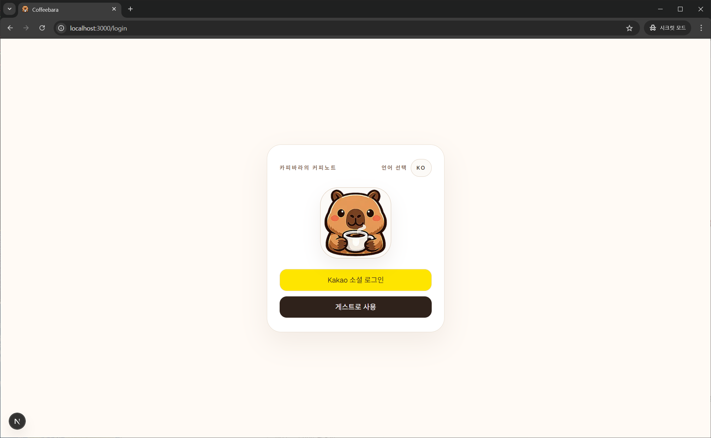

#### 회원 홈 화면

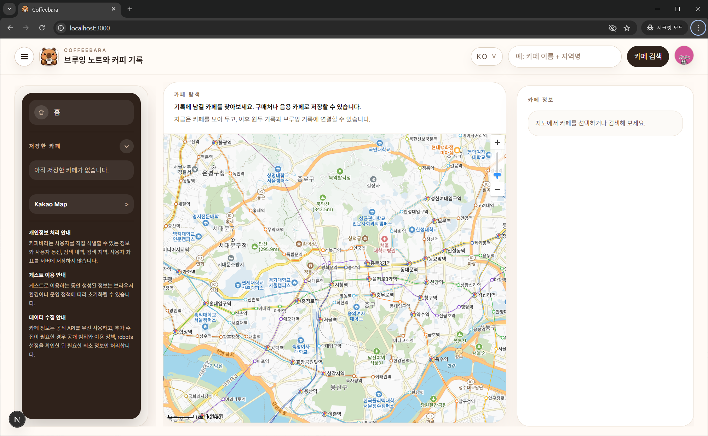

#### 회원 계정 메뉴

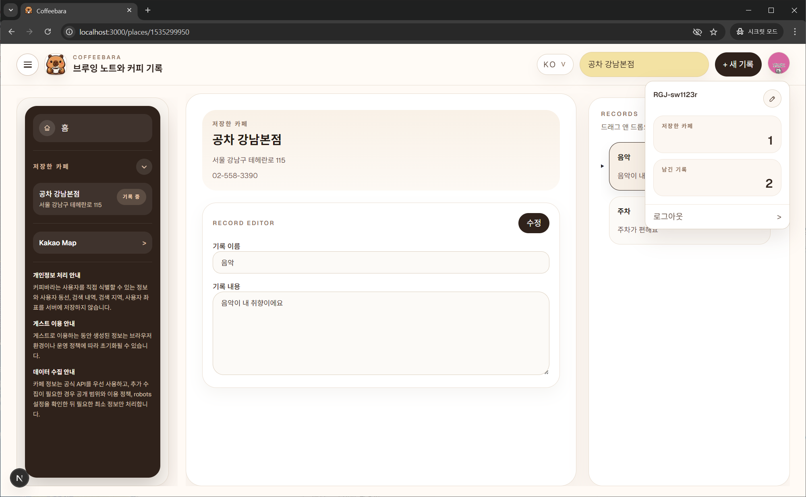

### 카페 검색 / 저장

#### 카페 검색 결과

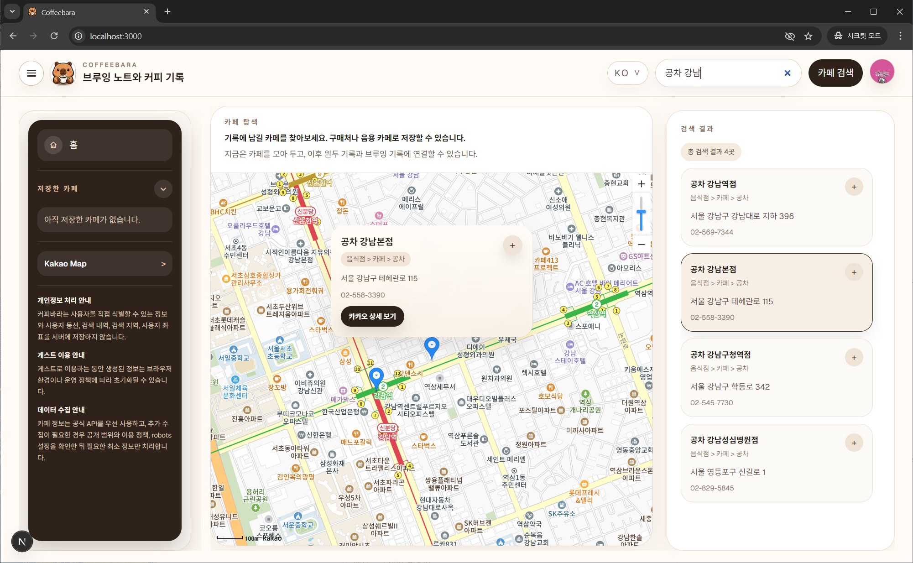

#### 저장한 카페 삭제 확인

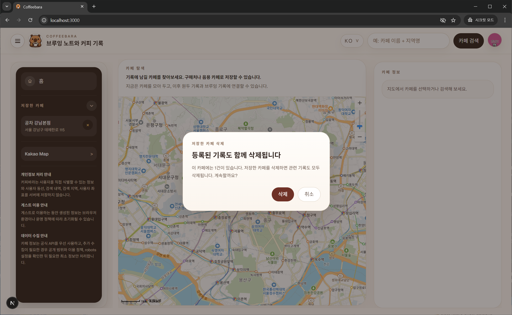

### 기록 기능

#### 기록 화면 진입

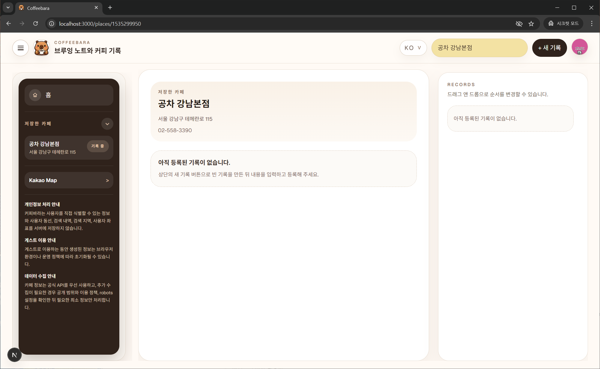

#### 새 기록 타입 선택

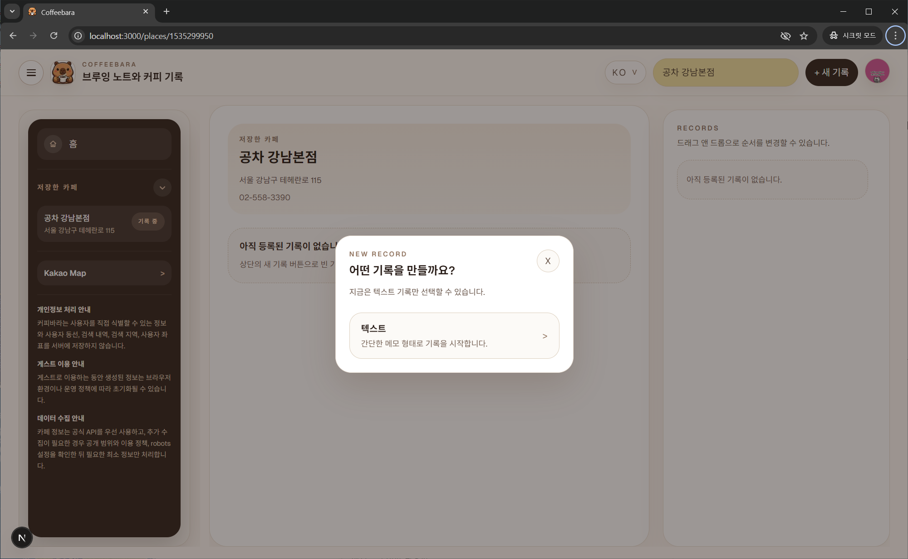

#### 텍스트 기록 편집 화면

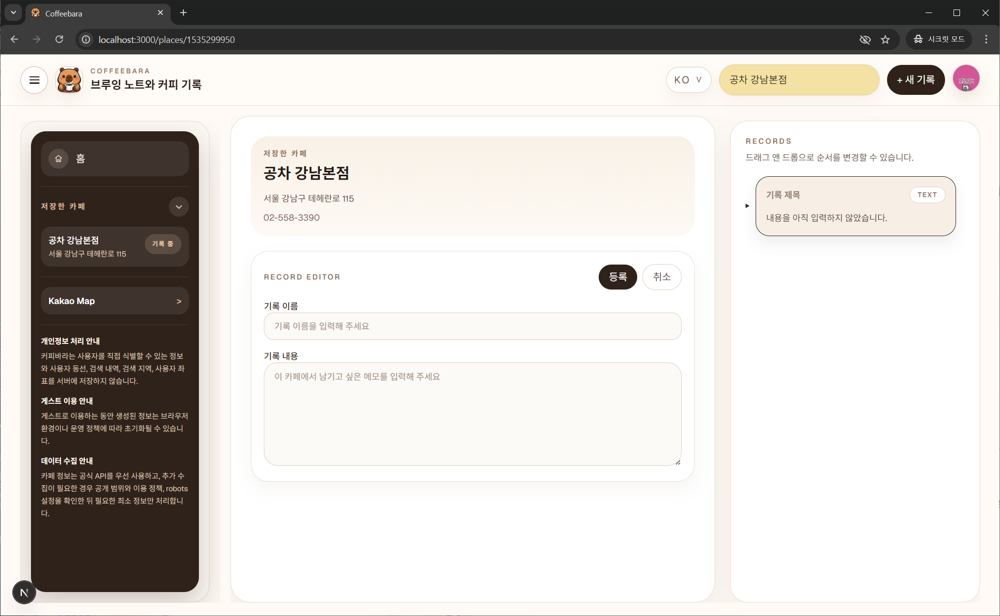

#### 텍스트 기록 목록

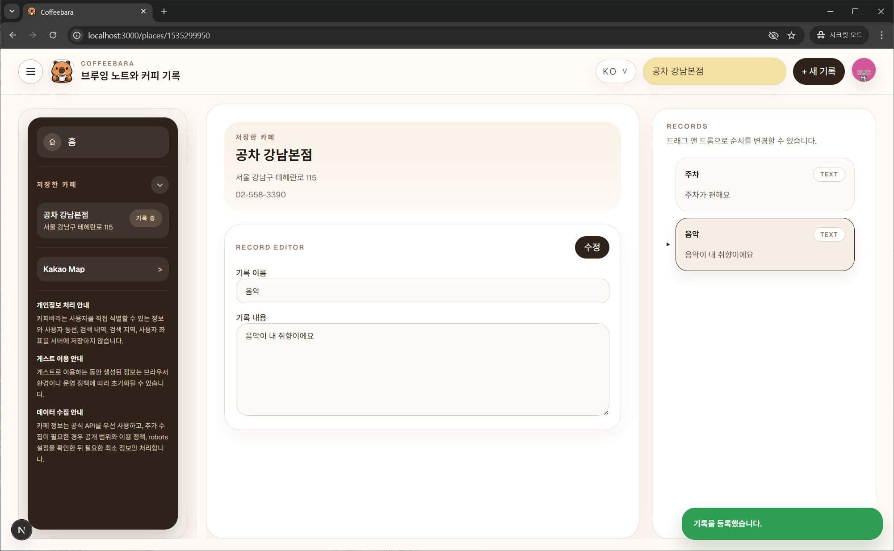

#### 기록 순서 변경 결과


#### 기록 삭제 메뉴

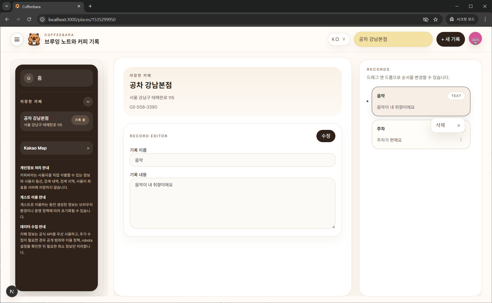

#### 기록 삭제 결과

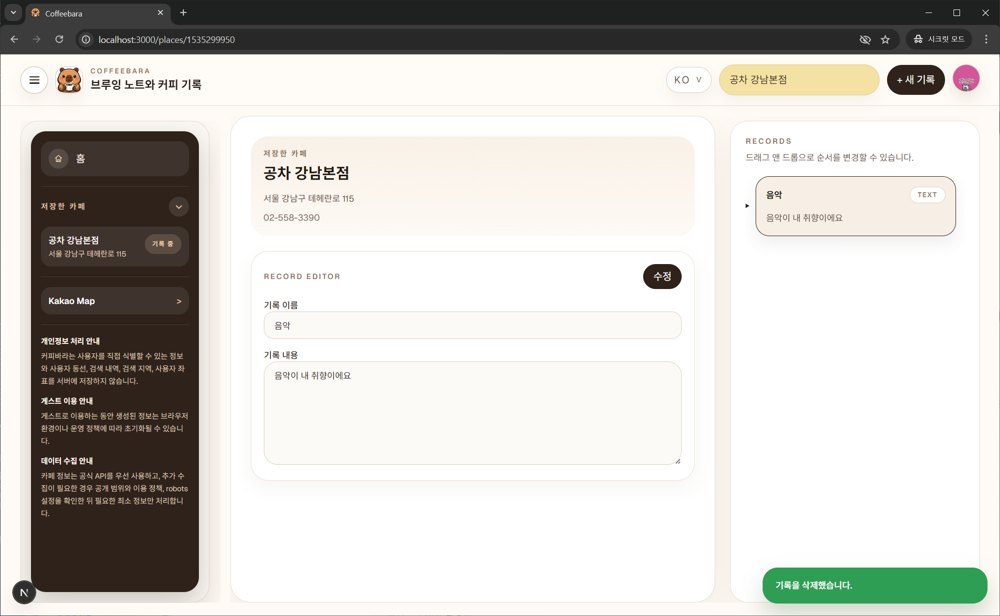

### 게스트 모드

#### 게스트 홈 화면

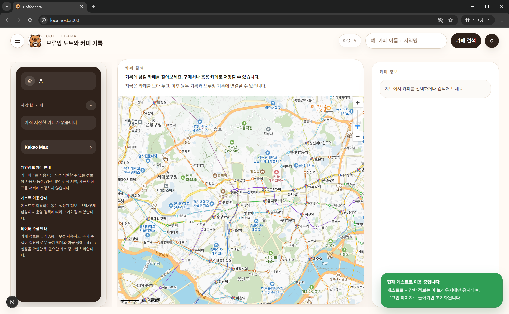

</details>

## 현재 제품 해석

현재 저장소를 설명할 때는 아래처럼 해석하는 것이 맞습니다.

- `cafe`는 장소 캐시/마스터 테이블입니다.
- `user_saved_cafe`는 회원이 저장한 카페 관계 테이블입니다.
- `cafe_record`는 회원이 카페 맥락에 연결해 남기는 기록의 부모 레이어입니다.
- `cafe_note`는 현재 구현된 텍스트 기록 페이로드 레이어입니다.
- 게스트 저장 카페는 계정 데이터가 아니라 localStorage 기반 임시 상태입니다.
- 카페는 제품의 중심이 아니라, 기록을 위한 맥락 데이터입니다.

즉, “카페 추천 서비스”가 아니라 “개인 커피 기록 서비스”로 봐야 합니다.

## 기술 스택

### Backend

- Java 21
- Spring Boot 4.0.5
- Gradle
- MyBatis
- MariaDB
- p6spy

### Frontend

- Next.js 16
- React 19
- Tailwind CSS 4
- ESLint 9

## 주요 API

### Auth

- `GET /api/auth/status`
- `POST /api/auth/guest`
- `POST /api/auth/logout`
- `GET /api/auth/logout/kakao-account`
- `PATCH /api/auth/profile/display-name`

### Cafe

- `GET /api/cafes/search`
- `GET /api/cafes/{placeId}`
- `GET /api/cafes/map`
- `GET /api/cafes/map/search`
- `POST /api/cafes`

### Member Saved Cafes

- `GET /api/user-saved-cafes`
- `POST /api/user-saved-cafes`
- `GET /api/user-saved-cafes/{placeId}/delete-check`
- `DELETE /api/user-saved-cafes/{placeId}`

### Cafe Notes

- `GET /api/cafe-notes/{placeId}`
- `POST /api/cafe-notes/{placeId}`
- `DELETE /api/cafe-notes/{placeId}/{noteId}`

## 저장소 구조

```text
coffeebara/
├─ src/
│  └─ main/
│     ├─ java/com/coffeebara/
│     └─ resources/
├─ frontend/
│  ├─ app/
│  ├─ public/
│  └─ package.json
├─ db/
│  └─ schema.sql
├─ docs/
│  └─ archive/
│  └─ readme-assets/
│     ├─ auth/
│     ├─ cafe/
│     ├─ home/
│     └─ record/
├─ AGENTS.md
├─ product-direction-notes.md
└─ README.md
```

## 실행 방법

### Backend

저장소 루트에서:

```bash
./gradlew bootRun
```

### Frontend

`frontend/`에서:

```bash
cd frontend
npm install
npm run dev
```

## 로컬 실행에 필요한 것

최소한 아래 설정이 필요합니다.

- Kakao REST API Key
- Kakao JavaScript Key
- Kakao OAuth 연동 설정
- MariaDB 연결 정보

기본 포트:

- Backend: `18080`
- Frontend: `3000`

## 이 프로젝트가 아닌 것

현재 Coffeebara는 아래 방향을 목표로 하지 않습니다.

- 카페 추천 플랫폼
- 공개 리뷰 서비스
- 소셜 피드/팔로우 서비스
- 커뮤니티 중심 제품
- AI가 핵심 가치인 제품

## 정리

Coffeebara는 사용자의 커피 경험을 검색, 저장, 기록, 회고할 수 있도록 설계한 개인 커피 아카이브 및 브루잉 기록 서비스입니다.

지금은 카페 검색, 지도 탐색, 장소 캐시, 회원 저장 카페, 회원 텍스트 기록 흐름, 게스트 저장 흐름까지 정리된 상태이고, 다음 단계는 원두/브루잉 기록과 개인 기록 허브를 실제로 붙여 나가는 일입니다.

## License

이 프로젝트는 MIT License를 따릅니다. 자세한 내용은 [LICENSE](./LICENSE)를 참고해 주세요.
